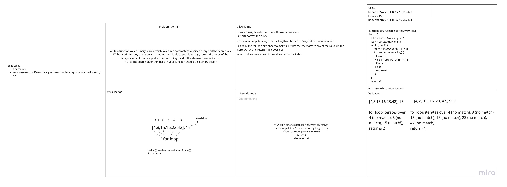

# Array Binary Search
This is the third 401 code challenge written in JavaScript.

## Challenge
Write a function called `BinarySearch` which takes in 2 parameters: a sorted array and the search key. Without utilizing any of the built-in methods available to your language, return the index of the array’s element that is equal to the search key, or -1 if the element does not exist.

## Approach & Efficiency
My parner and I worked together on the whiteboard and gave ourselves one hour. We realized too late that we didn't fully read the directions and used a for loop instead of a binary search. We only had a few minutes to figure out how to use a binary search. We decided to use our remaining time to research binary search and came up with a few good resources but were able to fully refactor our code (in the Code section of our whiteboard), but not redo the rest of our whiteboard. I guess we learned the hard way to thoroughly read the directions. 

## Solution
Array Binary Search Whiteboard

