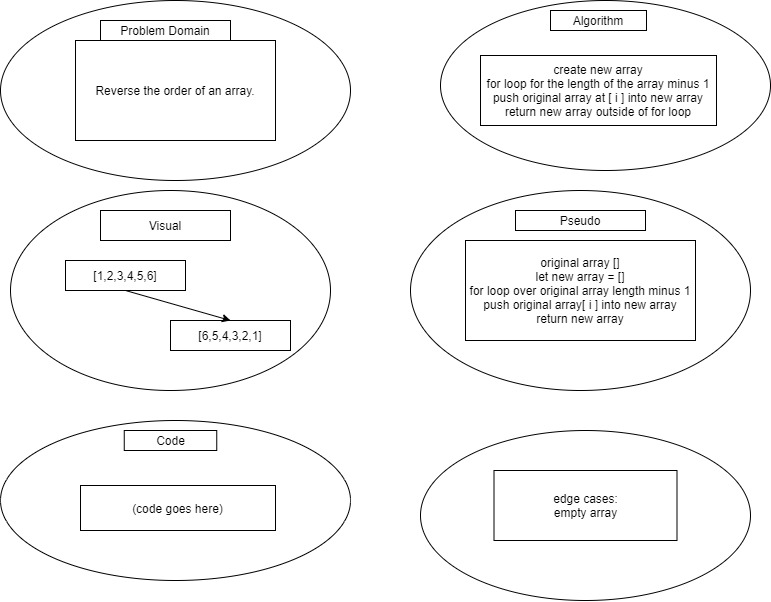

# Reverse an Array
This is the first 401 code challenge written in JavaScript.

## Challenge
Write a function called `reverseArray` which takes an array as an argument. Without utilizing any of the built-in methods available to your language, return an array with elements in reversed order.

## Approach & Efficiency
Luckily, I have done this exact problem before on an Edabit code challenge so I remembered how to solve it pretty quickly. I believe the space AND time efficiency of my code is sufficient.

## Solution
Array Reverse Whiteboard

