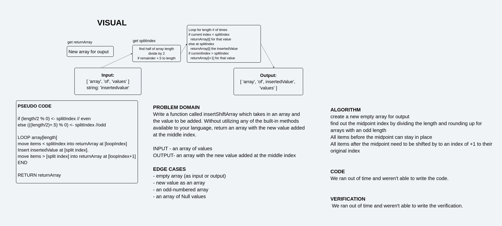

# Array Shift
This is the second 401 code challenge written in JavaScript.

## Challenge
Write a function called `insertShiftArray` which takes in an array and the value to be added. Without utilizing any of the built-in methods available to your language, return an array with the new value added at the middle index.

## Approach & Efficiency
My parner and I worked together on the whiteboard and gave ourselves one hour. We decided to:
- create a new empty array for output 
- find out the midpoint index by dividing the length and rounding up for arrays with an odd length
- All items before the midpoint can stay in place
- All items after the midpoint need to be shifted by to an index of +1 to their original index

## Solution
Array Shift Whiteboard
