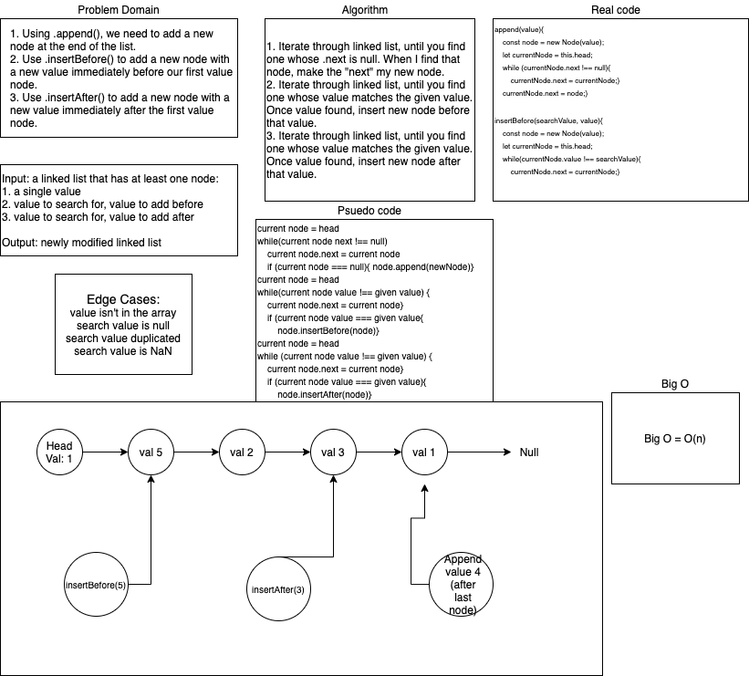
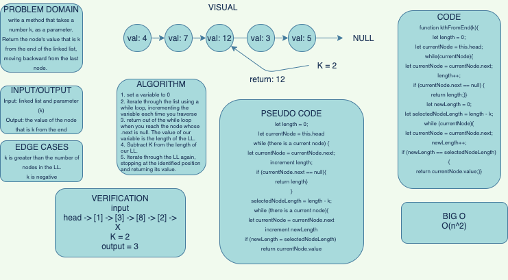

# Singly Linked List
a series of challenges based on singly linked lists

## Challenge

#### Features
- Create a Node class that has properties for the value stored in the Node, and a pointer to the next Node.
- Within your LinkedList class, include a head property. Upon instantiation, an empty Linked List should be created.
- Define a method called `insert` which takes any value as an argument and adds a new node with that value to the `head` of the list with an O(1) Time performance.
- Define a method called `includes` which takes any value as an argument and returns a boolean result depending on whether that value exists as a Node’s value somewhere within the list.
- Define a method called `toString` which takes in no arguments and returns a string representing all the values in the Linked List, formatted as:
`"{ a } -> { b } -> { c } -> NULL"`

Write tests to prove the following functionality:
1. Can successfully instantiate an empty linked list
1. Can properly insert into the linked list
1. The head property will properly point to the first node in the linked list
1. Can properly insert multiple nodes into the linked list
1. Will return true when finding a value within the linked list that exists
1. Will return false when searching for a value in the linked list that does not exist
1. Can properly return a collection of all the values that exist in the linked list

## Approach & Efficiency
I did test-driven development, so I wrote all my tests before writing code. All tests are passing. I believe the Big O for this approach is 0(n) since the linked list can be of an unknown size. 

## API
- `isEmpty()` checks whether or not a linked list is empty and returns true for an empty linked list and false for a linked list with values.
- `insert(value)` inserts a node at the beginning of a given linked list.
- `append(value)` adds a value to the end of a linked list.
- `includes(val)` which takes any value as an argument and returns a boolean result depending on whether that value exists as a Node’s value somewhere within the list
- `toString()` which takes in no arguments and returns a string representing all the values in the Linked List, formatted as: "{ a } -> { b } -> { c } -> NULL"

# Singly Linked List
a series of challenges based on singly linked lists

## Challenge

#### Features
- `.append(value)` which adds a new node with the given value to the end of the list
- `.insertBefore(value, newVal)` which add a new node with the given newValue immediately before the first value node
- `.insertAfter(value, newVal)` which add a new node with the given newValue immediately after the first value node

Write tests to prove the following functionality:
1. Can successfully add a node to the end of the linked list
1. Can successfully add multiple nodes to the end of a linked list
1. Can successfully insert a node before a node located i the middle of a linked list
1. Can successfully insert a node before the first node of a linked list
1. Can successfully insert after a node in the middle of the linked list
1. Can successfully insert a node after the last node of the linked list

## Approach & Efficiency
My teammates and I gave ourselves an hour to whiteboard. I believe the Big O for this approach is 0(n) since the linked list can be of an unknown size. 

## API
- `append(value)` finds the end of a linked list and appends the value to the end position.
- `.insertBefore(value, newVal)` iterates over the linked list in search of a node with the value. If it finds the value, it adds the newVal before it. 
- `.insertAfter(value, newVal)` iterates over the linked list in search of a node with the value. If it finds the value, it adds the newVal after it. 

## Solution

# Challenge Summary
Return the k-th value from the end of a linked list.

## Challenge Description
Write a method for the Linked List class which takes a number, k, as a parameter. Return the node’s value that is k from the end of the linked list. You have access to the Node class and all the properties on the Linked List class as well as the methods created in previous challenges.

## Approach & Efficiency
My partner and I whiteboarded for an hour, and came up with the solution below. We thought we should traverse the LL to calculate its length, then subtract K from that length, then traverse the LL to that position. Since we will be traversing the LL twice, the Big O is 0(n^2).

## Solution

# Challenge Summary
Zip two linked lists.

## Challenge Description
Write a function called zipLists which takes two linked lists as arguments. Zip the two linked lists together into one so that the nodes alternate between the two lists and return a reference to the head of the zipped list. Try and keep additional space down to O(1). You have access to the Node class and all the properties on the Linked List class as well as the methods created in previous challenges.

## Approach & Efficiency
My partner and I whiteboarded for an hour, and didn't get as far ad we'd hoped to. We were contemplatng how to integrate some of the other methods into our solution and ran out of time. 

## Solution
